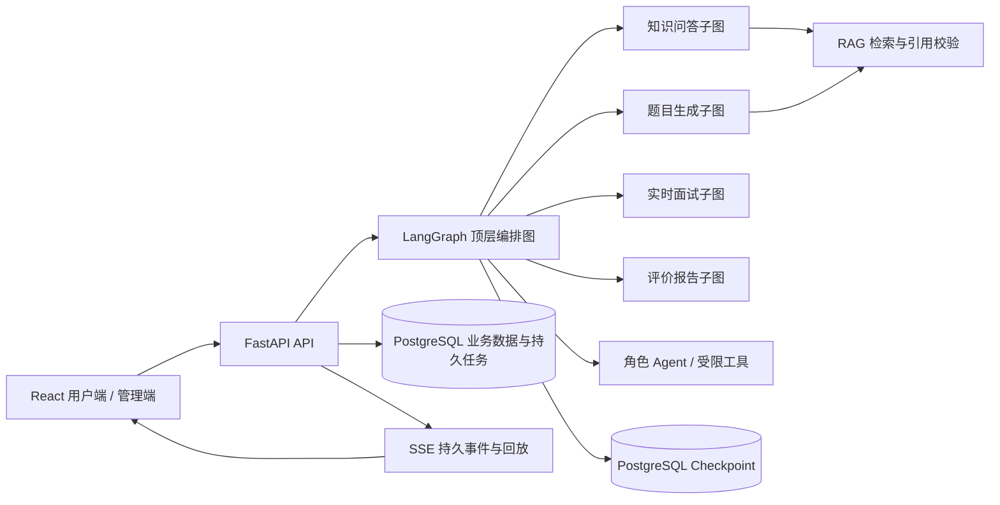

# 知弈 SageMatch

基于多 Agent 编排与检索增强生成（RAG）的岗位定制化模拟面试系统。用户可以围绕目标岗位生成题目、进行连续面试，并根据作答记录获得有依据的分项复盘；管理端负责材料、模型、召回和评测管理。

> 当前面向单人私有使用与研究验证。仓库提供可运行的前后端及私有部署配置，但不提供公开多用户服务或已验收的公网演示地址。

## 项目背景

通用题库很难贴合具体岗位与知识材料；单轮 AI 问答缺少真实面试中的追问、上下文连续性和过程记录；单一总分也难以解释候选人的具体短板。知弈将岗位输入、知识检索、题目生成、实时追问和证据化复盘连接成完整流程，并重点处理 Agent 的调用边界、流式交互中断和生成内容的可核查性。

## 主要功能

| 模块 | 当前能力 |
| --- | --- |
| 会话与知识问答 | 创建和管理会话，流式输出回答；知识问题可检索已入库材料并引用来源。支持流事件按 ID 回放。 |
| 岗位定制出题 | 提交岗位信息生成题集；Author 生成候选题，经过规则校验、Critic 审核和至多一次修订。 |
| 实时模拟面试 | 按题作答、同题追问、推进或结束；持久化作答与追问状态。支持文字输入，以及依赖浏览器能力的语音识别和朗读。 |
| 面试复盘 | Scorer 对技术能力、问题分析、方案权衡、表达沟通四项分别给出 0–25 分及依据；程序校验后汇总总分，Coach 生成建议。无效评分会显式标记。 |
| 知识材料 | 上传和管理 TXT、Markdown、DOCX、PDF 材料；后台解析、分块、可选向量化和索引。提供召回调试页面。 |
| 管理与评测 | 配置模型供应商及角色绑定，查看调用与审计记录，运行题目和评分评测；真实 RAG 固定集另有命令行评测及人工复核流程。 |

## 使用流程

1. 在管理端配置模型供应商与角色绑定，按需上传岗位或知识材料并等待索引就绪。
2. 在会话中提问，或从“模拟面试”入口输入岗位要求生成题集。
3. 逐题作答；面试官可围绕当前回答追问，系统保存对话与题目进度。
4. 结束后查看四维评分、作答依据和改进建议，也可导出文本报告。

语音功能使用 Web Speech API，实际可用性取决于浏览器、系统语音能力和麦克风权限；文字输入始终可用。

## 技术架构



### 多 Agent 编排

- 顶层图处理业务路由、策略检查、子图调度、观察、校验、提交和 checkpoint；知识问答、题目生成、实时面试、评价报告各有业务子图。
- Analyst、Author、Critic、Interviewer、Scorer、Coach 等角色有明确输入输出契约、工具白名单及步骤/时限预算。角色内部由 LangGraph 管理有界工具调用，业务子图决定调用顺序。
- Checkpoint 保存可恢复的编排状态；PostgreSQL 业务表保存已提交的会话、面试、报告和材料事实。图节点与工具调用追踪用于定位失败及恢复过程。

核心代码：[顶层图](backend/app/agents/orchestration/graph.py) · [角色契约](backend/app/agents/contracts/contracts.py) · [业务子图](backend/app/agents/workflows) · [Checkpoint](backend/app/agents/orchestration/checkpoint.py)

### RAG 证据链

1. 材料上传后由持久后台任务解析、分块，并在配置可用时生成向量；材料及片段保存在 PostgreSQL。
2. 检索保留原始问题，可结合近期对话改写查询；词法与向量召回并行，之后融合、去重和治理候选。
3. 可用时调用 reranker 精排，按上下文预算选择片段；模型不可用时记录回退原因，部分步骤可降级。
4. 回答引用选中的来源编号，经过确定性引用校验，必要时尝试一次修复。编号合法不等于内容真正支持断言，因此真实评测另需逐条 claim 人工复核。

核心代码：[材料处理](backend/app/services/materials/knowledge.py) · [检索流程](backend/app/services/materials/recall.py) · [RAG 阶段](backend/app/services/materials/rag) · [配置](backend/config/rag.yaml)

### 可靠性与观测

- 材料处理、出题和报告生成使用数据库持久任务、租约及幂等控制，进程重启后可继续未完成工作。
- 聊天和出题的流式事件先持久化，再通过 SSE 发送；客户端携带最后收到的事件 ID 续读，减少断线后的重复展示。
- PostgreSQL checkpoint 负责图执行恢复，并校验线程归属和状态版本；健康检查区分存活与就绪，检查数据库、checkpoint 和后台 worker。
- 管理概览及日志记录模型调用、图节点和工具事件。只有存在实际样本时才计算运行指标。

## 技术栈

| 层次 | 技术与用途 |
| --- | --- |
| 前端 | React 19、TypeScript 5、Vite 7、React Router 7、Tailwind CSS 4、Motion、Lucide Icons；SSE 流式交互。 |
| 后端 | Python 3.11、FastAPI、Pydantic、SQLAlchemy 2、Psycopg 3、Uvicorn、SSE Starlette。 |
| Agent 与模型 | LangGraph 主图/子图、角色工具循环及 PostgreSQL checkpointer；LangChain Core、LangChain OpenAI 用于模型/工具适配；外部模型供应商。 |
| 数据与检索 | PostgreSQL 保存业务数据、任务、材料片段和 checkpoint；词法匹配、可选 embedding 余弦相似度、候选融合、reranker、引用校验。当前不依赖独立向量数据库。 |
| 测试与部署 | Pytest 单元及隔离 PostgreSQL 集成测试、Node 测试、TypeScript 构建；GitHub Actions；Docker Compose、Nginx 和 PostgreSQL 备份脚本用于私有部署。 |

## 本地运行

### 环境要求与配置

- Python 3.11、Node.js 24、npm、PostgreSQL。以下命令以 Windows PowerShell 7 为例。
- 创建名为 `sagematch` 的 PostgreSQL 数据库及可连接账号。后端启动需要可用的 PostgreSQL checkpointer，只有前端无法完成业务操作。
- 至少配置一个可用的对话模型；查询改写、embedding、reranker 可分别配置，其接口须与所选供应商能力匹配。

在仓库根目录复制模板并填写 `POSTGRES_*`、`LLM_*` 及按需启用的 `SAGEMATCH_RAG_*`：

```powershell
Copy-Item .env.example .env
```

角色模型也可在管理端绑定。检索数值与策略放在 `backend/config/rag.yaml`；密钥只放本地 `.env` 或私有密钥存储，不要提交到 Git。不准备使用某个 RAG 模型能力时，可将对应 `*_ENABLED` 设为 `false`。

> 当前按单人匿名身份工作，`/admin` 和管理 API 没有内建多用户登录鉴权。仅在可信本机或有独立访问控制的私有环境运行，不要直接向公网开放后端。

### 启动后端

```powershell
python -m venv .venv
.\.venv\Scripts\python.exe -m pip install -r backend\requirements.txt
cd backend
..\.venv\Scripts\python.exe run.py --reload --port 8000
```

Windows 入口脚本为 Psycopg 异步 checkpoint 选择兼容的事件循环，默认绑定 `127.0.0.1`。另开终端启动前端：

```powershell
cd frontend
npm ci
npm run dev
```

默认地址：用户端 `http://localhost:5173/`，管理端 `http://localhost:5173/admin`，API 文档 `http://127.0.0.1:8000/docs`，就绪检查 `http://127.0.0.1:8000/api/health/ready`。前端开发服务器将 `/api` 代理至本机后端；更改后端端口时，设置 `SAGEMATCH_API_PORT` 后再启动前端。

已经准备好当前索引对应的私有真实 RAG 固定集、原始报告和人工复核结果时，可在仓库根目录使用 `pwsh -NoProfile -File .\backend\scripts\start_private_checked.ps1`。该入口先核验质量门禁，失败时拒绝启动后端；普通开发使用上述 `run.py` 即可。

## 测试与质量评测

```powershell
# 仓库根目录
.\.venv\Scripts\python.exe -m pip install pytest
.\.venv\Scripts\python.exe -m pytest backend/tests -q

# 前端目录
cd frontend
npm run build
node --test tests/http-sse.test.mjs
```

`backend/tests/unit` 覆盖图状态、角色工具、RAG、面试及运行策略；`backend/tests/integration/postgres` 在隔离数据库环境中覆盖任务恢复、checkpoint、并发和流式回放。集成测试依赖其约定的测试数据库环境，具体条件以测试文件为准。CI 工作流见 [后端契约检查](.github/workflows/backend-contracts.yml) 和 [RAG 质量检查](.github/workflows/rag-quality.yml)。

真实 RAG 评测与普通自动化测试分开：固定集绑定当前材料索引指纹，按基线、查询改写、候选治理、重排、引用约束、claim coverage 分阶段运行，并用人工标签复核回答。私有固定集和报告不在仓库中；GitHub 托管 CI 的合成测试不能证明真实模型质量。步骤见 [RAG 真实评测运行指南](docs/architecture/RAG真实评测运行指南.md)。

## 项目结构

```text
backend/
  app/agents/       # 角色契约、模型路由、工具、顶层图及四类业务子图
  app/api/          # 会话、面试、管理端 HTTP/SSE 接口
  app/services/     # 面试、材料、聊天、运行任务与评测逻辑
  app/core/         # 配置、数据库、运行策略
  config/rag.yaml   # RAG 数值及策略配置（不存密钥）
  tests/            # 单元测试、PostgreSQL 集成测试、合成固定集
frontend/
  src/features/     # 会话、面试、管理页面
  src/api/          # 领域 API 与 SSE 客户端
  src/components/   # 共享组件
  src/layout/       # 用户端与管理端外壳
docs/architecture/  # Agent 架构说明与真实 RAG 评测指南
deploy/sagematch/   # 私有部署配置与备份脚本
.github/workflows/   # 自动化检查
```

## 当前状态与限制

- 核心会话、RAG、出题、面试、复盘及管理流程已有代码实现和相应测试；不同供应商的模型能力与效果需要分别验证。
- 当前是单人私有项目，不具备公开多用户账号、租户隔离和应用内管理鉴权。正式对外服务需补充相应安全和运维能力。
- PDF 使用项目内的基础文本抽取逻辑，扫描件、图片型 PDF 和复杂排版可能无法可靠解析；DOCX 仅处理正文文本。
- 已有云端私有预部署与回环访问验证，但公网域名及证书尚未完成验收；仓库不提供公开演示地址。

